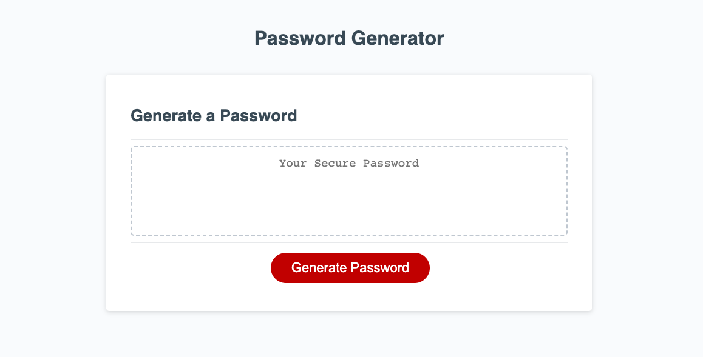

# Password Generator

## Description
This password generator will allow you to create a password to you liking, by choosing whether you would like uppercase, lowercase, or special characters along with how long you would like the password to be. 
## Instructions 
1. Click on the Generate Password red button.
2. Choose the length of you password (must be 8-128 characters long).
3. Choose whether you would like lowercase characters.
4. Choose whether you would like uppercase characters.
5. Choose whether you would like numbers in your password.
6. Lastly, choose whether you would like special characters in your password.
7. The password will appear within the "Your Secure Password" box. Feel free to copy this into your password manager.
## Credits
The CSS, HTML, and any element described by a comment that says "- provided in starter code" was provided by UNC Chapel Hill. Everything else was created by me. 

I had assistance with this assignment from Santi P (TA) and learning assistants. 
## Screenshot

## Link to Repo and Deployed Application
Link to Repo: https://github.com/anicrob/week-3-challenge

Link to Deployed Application: https://anicrob.github.io/week-3-challenge/